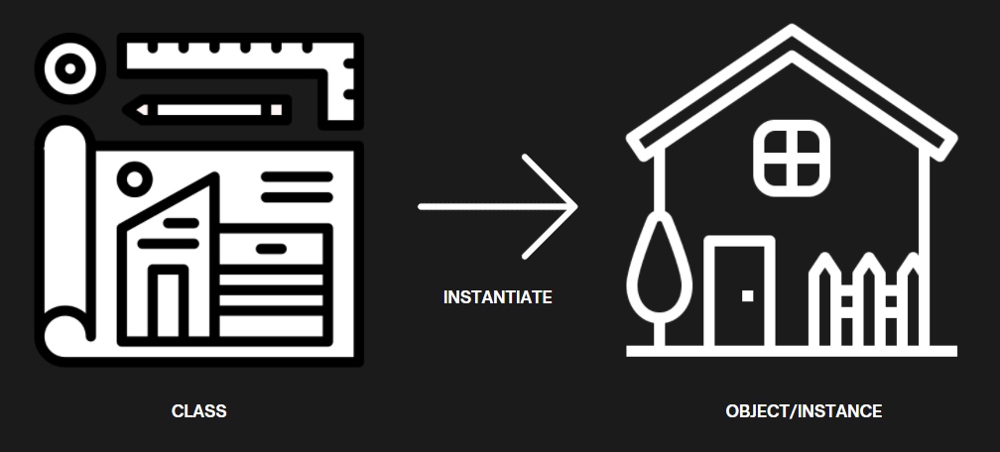

# Basic Object Oriented Programming

## 1. What
OOP adalah paradigma/model/konsep dalam pemrograman yang mendefinisikan desain dari software dalam bentuk OBJECT. 

Maksudnya object disini didasarkan pada object di dunia nyata contoh object yang namanya smartphone. Smartphone diibaratkan mempunyai property dan juga method yang nanti ada penjelasannya di bawah.

## 2. Why
- Flexibility and maintainability
- Data can be hidden and cannot accessed by external code
- Simpler to develop and easier to understand
- New data and functions can be easily added

## 3. Class and Object



`CLASS` adalah blueprint/cetakan/rancangan

`INSTANSTIATE` adalah proses pembuatan object dari class

`OBJECT` adalah hasil instance dari class

Didalam OOP `VARIABLE` disebut juga dengan `PROPERTY` dan `FUNCTION` disebut juga dengan `METHOD`

Penamaan class: 
- PascalCase
- Singular

## 4. Constructor
Constructor adalah function yang dijalankan ketika proses INSTANSTIATE. Constructor biasanya digunakan untuk inisiasi property.

## 5. Let's Try

Kita punya sebuah smartphone yang memiliki spesifikasi
- `CPU` snapdragon 2070 
- `color` red

```js
let jajangSmartphone = {
  name : 'Iphul S20 Lite',
  cpu : 'Bionic 1660S',
  color : 'red'
}
let teddySmartphone = {
  name : 'Samsul 12 Pro Max',
  cpu : 'Bionic 2070',
  color : 'black'
}
let alexSmartphone = {
  name : 'Samsul 12 Pro Max Lite Super',
  cpu : 'Bionic 2070 TI',
  color : 'violet'
}
```

Jika misalnya ada penambahan property didalam object maka kita harus menambahkan property baru ke semua object yang ada.

jika dengan menggunakan konsep oop jadinya seperti ini,

```js
class Smartphone {
    constructor(name, cpu, color) {
        this.name = name
        this.cpu = cpu
        this.color = color
    }

    bisaNyala() {}
    swipeLeft() {}
    swipeRight() {}
    showSpec() {}
}

let jajangSmartphone = new Smartphone("Iphul S20 Lite", "Bionic 1660S", "red")
let teddySmartphone = new Smartphone("Samsul 12 Pro Max", "Bionic 2070", "black")
let alexSmartphone = new Smartphone("Samsul 12 Pro Max Ultra Lite Super", "Bionic 2070 TI", "violet")

console.log(jajangSmartphone)
```

Alur dari pembuatan sebuah object:


# Reference:
- https://www.petanikode.com/java-oop/
- https://www.freecodecamp.org/news/object-oriented-programming-concepts-21bb035f7260/
- https://developer.mozilla.org/en-US/docs/Web/JavaScript/Reference/Classes/
- https://medium.com/backticks-tildes/understanding-method-chaining-in-javascript-647a9004bd4f
- https://www.tutorialspoint.com/method-chaining-in-javascript
- https://nodejs.org/api/fs.html
- https://dev.to/samanthaming/3-ways-to-set-default-value-in-javascript-2253
- https://www.tutorialsteacher.com/nodejs/nodejs-module-exports
- https://nodejs.org/docs/latest-v14.x/api/fs.html#fs_file_system
